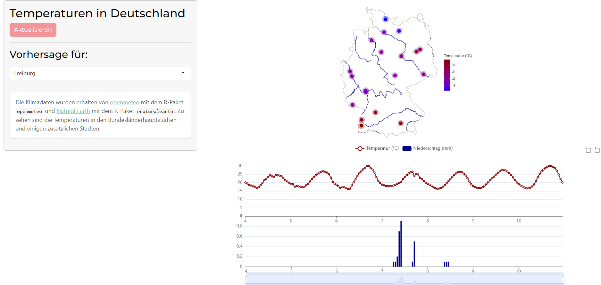

# Shiny-app to present temperature in Germany

This Shiny-app allows to view the current temperature in major german cities. There is also the possibility to view the weather forecast for all those cities. The metereological data is obtained from the R-package [`openmeteo`](https://github.com/tpisel/openmeteo) and the geographic data from [`rnaturalearth`](https://github.com/ropensci/rnaturalearth). 

The app can be viewed under the following link: [https://carluna.shinyapps.io/shiny-klima/](https://carluna.shinyapps.io/shiny-klima/)

This is more a test to get to learn Shiny a little bit. 
Here you can see a screenshot of the app.

